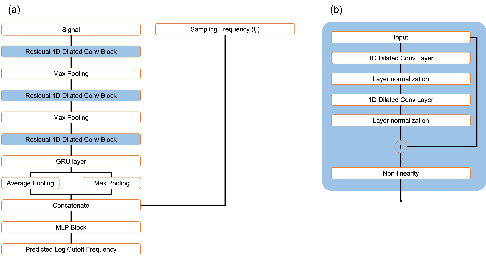

# Cutoff Frequency Determination Algorithm for Ferroelectric Device Pulse Measurements

This repository contains the implementation and supplementary materials for the paper  
**"Cutoff Frequency Determination Algorithm for Ferroelectric Device Pulse Measurements with Application to Machine Learning-Based Prediction."**

---

## Overview

Ferroelectric (FE) devices such as **FeRAM** and **FeFET** are widely used due to their spontaneous polarization properties.  
Accurate measurement and noise filtering of FE pulse signals are essential for analyzing intrinsic device characteristics such as remnant polarization, coercive field, and charge density.

This work proposes a **deterministic algorithm** and a **deep learning model** for automated cutoff frequency selection and signal denoising in ferroelectric pulse measurements.

---

## Key Contributions

1. **Deterministic Cutoff Frequency Algorithm**
   - Identifies plateau regions in the **log-MSE–frequency** curve between raw and denoised signals.  
   - Determines the cutoff frequency based on the minimum point of the **inverse gradient of the logarithmic MSE curve**.
   - Provides a **reproducible and quantitative criterion** for noise filtering.

2. **Deep Learning Model for Prediction**
   - A hybrid **1-D dilated CNN + GRU** model that predicts the cutoff frequency directly from raw signals.
   - Learns both **local waveform details** and **global temporal dependencies**.
   - Remains robust even under **low sampling resolution** or limited data conditions.

3. **Automated Post-Processing**
   - Calculates current and charge density from denoised voltage signals.
   - Extracts key charge metrics such as **Q_charge**, **Q_res**, and **Q_discharge** for ferroelectric characterization.

---

## Algorithm Description

The deterministic algorithm performs the following steps:

1. Converts the raw signal into the frequency domain using FFT.  
2. Computes the mean squared error (MSE) between the original and low-pass filtered signals across candidate frequencies.  
3. Applies a logarithmic scale to the MSE curve and analyzes its gradient with respect to log frequency.  
4. Inverts the gradient to highlight plateau regions, then identifies the point where this inverted gradient reaches its minimum — corresponding to the optimal cutoff frequency.
5. Multiplies the detected cutoff by a small safety margin (15%).
6. Reconstructs the denoised signal using inverse FFT and applies DC offset correction.

---

## Deep Learning Architecture

  

- **Input:** Raw voltage signal  
- **Layers:** 
  - Three residual 1-D dilated convolution blocks (dilation rates: 1, 2, and 4)  
  - Bidirectional GRU layer (hidden size: 64 per direction)  
  - Global average and max pooling  
  - Fully connected regression head  
- **Output:** Predicted logarithmic cutoff frequency  
- **Loss function:** Mean squared error between logs of predicted and algorithm-labeled cutoff frequencies  

---

## Dataset

- **Device:**: Hf₁₋ₓZrₓO₂-based MFM structure

- **Raw samples**-: 7,492 measured current signals

- **Downsampling augmentation**-: 
Each raw signal is progressively downsampled by multiple factors until the failure point (fail_r) is reached,
generating a set of valid low-resolution signals per sample

- **Total samples**-: 32637

- **Data split**-: 70% training / 15% validation / 15% test (split performed at the original-sample level to avoid leakage)
---

## Results

| Metric | Model | Test (Full) | Test-Half | Test-Third |
|:------:|:-----:|:-----------:|:---------:|:----------:|
|  | CNN | 0.0716 | 0.0752 | 0.0954 |
| **MAE (log10 Hz)** | GRU | 0.0737 | 0.0798 | 0.0982 |
|  | CNN-GRU | **0.0676** | **0.0743** | **0.0945** |
|  |  |  |  |  |
|  | CNN | 7.99 | 7.37 | **7.06** |
| **MAE (MHz)** | GRU | 8.03 | 7.71 | 8.03 |
|  | CNN-GRU | **6.80** | **6.61** | 7.23 |
|  |  |  |  |  |
|  | CNN | 0.0178 | 0.0150 | 0.0228 |
| **MSE (log10 Hz)** | GRU | 0.0164 | 0.0162 | 0.0249 |
|  | CNN-GRU | **0.0145** | **0.0133** | 0.0231 |
|  |  |  |  |  |
|  | CNN | 1.99e3 | 1.21e3 | 0.13e3 |
| **MSE (MHz^2)** | GRU | 1.48e3 | 0.70e3 | 0.28e3 |
|  | CNN-GRU | **0.43e3** | **0.25e3** | **0.12e3** |
|  |  |  |  |  |
|  | CNN | 17.52 | 18.58 | 25.94 |
| **MAPE (%)** | GRU | 18.56 | 20.24 | 28.71 |
|  | CNN-GRU | **16.26** | **17.94** | 26.74 |

- The model reproduces the algorithm’s cutoff estimation with high fidelity.  
- Maintains accuracy even when the input signals are heavily downsampled.  
- Enables **automated, consistent, and scalable** ferroelectric signal processing.

---